```mermaid
graph TD
    A[Root /] --> B[home]
    B --> C[abhilash<br/>📍 Current Location]
    
    style A fill:#667eea,stroke:#333,stroke-width:3px,color:#fff
    style B fill:#764ba2,stroke:#333,stroke-width:2px,color:#fff
    style C fill:#43e97b,stroke:#333,stroke-width:3px,color:#fff
```

# 📚 Day 4 - Interactive Learning Guide
## Linux Command Prompt & Basic Commands

---

## 1. Understanding the Linux Command Prompt

### What is the Command Prompt?

The **Command Prompt** (also called **Terminal** or **Shell**) is a text-based interface where you interact with the Linux operating system by typing commands.

### Command Prompt vs GUI

```
┌─────────────────────────────────────────────────────────┐
│              COMMAND PROMPT vs GUI                       │
└─────────────────────────────────────────────────────────┘

GUI (Graphical User Interface)          Command Prompt
┌─────────────────────┐                ┌─────────────────────┐
│  🖱️  Point & Click   │                │  ⌨️  Type Commands   │
│  🖼️  Visual Icons   │                │  📝  Text-Based      │
│  🎨  User-Friendly   │                │  ⚡  Fast & Powerful │
│  🐌  Slower         │                │  🚀  Efficient       │
└─────────────────────┘                └─────────────────────┘
```

### Why Use Command Prompt?

- **Power:** Execute complex operations quickly
- **Efficiency:** Faster than GUI for many tasks
- **Automation:** Script repetitive tasks
- **Remote Access:** Access servers via SSH
- **Resource Efficient:** Uses minimal system resources
- **Professional:** Standard tool for system administrators

### Opening the Terminal

#### Different Ways to Open Terminal

**Ubuntu/Debian:**
- Press `Ctrl + Alt + T`
- Search for "Terminal" in applications
- Right-click desktop → "Open Terminal Here"

**CentOS/RHEL:**
- Press `Ctrl + Alt + T`
- Applications → System Tools → Terminal

**macOS:**
- Press `Cmd + Space`, type "Terminal"
- Applications → Utilities → Terminal

**Windows (WSL):**
- Open PowerShell or Command Prompt
- Type `wsl` or `bash`

---

## 2. Decoding the Structure of the Command Prompt

### Command Prompt Components

When you open a terminal, you'll see a prompt that looks like this:

```mermaid
graph LR
    A[USER<br/>abhilash] --> B[@]
    B --> C[HOSTNAME<br/>ubuntu-server]
    C --> D[:]
    D --> E[CURRENT DIR<br/>/home/abhilash]
    E --> F[$]
    
    style A fill:#667eea,stroke:#333,stroke-width:2px,color:#fff
    style C fill:#764ba2,stroke:#333,stroke-width:2px,color:#fff
    style E fill:#43e97b,stroke:#333,stroke-width:2px,color:#fff
    style F fill:#f093fb,stroke:#333,stroke-width:2px,color:#fff
```

**Example:**
```
abhilash@ubuntu-server:/home/abhilash$ 
```

**Components:**
- **USER:** `abhilash` - Current logged-in user
- **HOSTNAME:** `ubuntu-server` - Name of the computer
- **CURRENT DIR:** `/home/abhilash` - Current directory
- **$:** Prompt symbol (indicates regular user)

### Detailed Breakdown

#### 1. Username
- **What it shows:** Current logged-in user
- **Example:** `abhilash`, `root`, `admin`
- **Purpose:** Identifies who is executing commands

#### 2. Hostname
- **What it shows:** Name of the computer/server
- **Example:** `ubuntu-server`, `localhost`, `web-server-01`
- **Purpose:** Identifies which machine you're on

#### 3. Current Directory
- **What it shows:** Your current location in the file system
- **Example:** `/home/abhilash`, `/var/www`, `/etc`
- **Purpose:** Shows where commands will execute

#### 4. Prompt Symbol
- **`$`** - Regular user prompt
- **`#`** - Root/Administrator prompt (be careful!)

### Example Prompts

```
┌─────────────────────────────────────────────────────────┐
│              EXAMPLE COMMAND PROMPTS                     │
└─────────────────────────────────────────────────────────┘

Regular User:
abhilash@ubuntu-server:/home/abhilash$ 

Root User (Administrator):
root@ubuntu-server:/root# 

Short Prompt (customized):
$ 

Minimal Prompt:
> 
```

### Understanding the Prompt Format

The prompt format can vary:

**Standard Format:**
```bash
username@hostname:directory$ 
```

**Root User Format:**
```bash
root@hostname:directory# 
```

**Custom Format:**
```bash
[user@host dir]$ 
```

---

## 3. Effective Command Prompt Usage: A Step-by-Step Guide

### Basic Command Structure

All Linux commands follow a general structure:


**Example:**
```bash
ls -l /home/abhilash
```

**Breakdown:**
- **Command:** `ls` - The action to perform
- **Options:** `-l` - Modifies command behavior (long format)
- **Arguments:** `/home/abhilash` - Additional information (directory path)

### Command Components Explained

#### 1. Command
- The action you want to perform
- Examples: `ls`, `cd`, `mkdir`, `cat`

#### 2. Options (Flags)
- Modify command behavior
- Usually start with `-` or `--`
- Examples: `-l`, `-a`, `--help`, `--version`

#### 3. Arguments
- Additional information for the command
- Usually file names, directories, or values
- Examples: `/home/user`, `file.txt`, `8080`

### Step-by-Step Usage Guide

#### Step 1: Open Terminal
```bash
# Press Ctrl + Alt + T (Ubuntu)
# Or search for "Terminal" in applications
```

#### Step 2: Check Current Directory
```bash
pwd
```

**Text Output:**
```
/home/abhilash
```

**Visual Diagram:**


#### Step 3: List Files
```bash
ls
```

**Text Output:**
```
Desktop  Documents  Downloads  Music  Pictures  Videos
```

**Visual Diagram:**


#### Step 4: List Files with Details
```bash
ls -l
```

**Text Output:**
```
total 24
drwxr-xr-x 2 abhilash abhilash 4096 Jan 15 10:30 Desktop
drwxr-xr-x 2 abhilash abhilash 4096 Jan 15 10:30 Documents
drwxr-xr-x 2 abhilash abhilash 4096 Jan 15 10:30 Downloads
drwxr-xr-x 2 abhilash abhilash 4096 Jan 15 10:30 Music
drwxr-xr-x 2 abhilash abhilash 4096 Jan 15 10:30 Pictures
drwxr-xr-x 2 abhilash abhilash 4096 Jan 15 10:30 Videos
```

**Visual Diagram:**


```mermaid
graph TD
    A[ls -l Output] --> B[📁 Desktop<br/>drwxr-xr-x<br/>Size: 4.0K<br/>Owner: abhilash]
    A --> C[📁 Documents<br/>drwxr-xr-x<br/>Size: 4.0K<br/>Owner: abhilash]
    A --> D[📁 Downloads<br/>drwxr-xr-x<br/>Size: 4.0K<br/>Owner: abhilash]
    A --> E[📁 Music<br/>drwxr-xr-x<br/>Size: 4.0K<br/>Owner: abhilash]
    A --> F[📁 Pictures<br/>drwxr-xr-x<br/>Size: 4.0K<br/>Owner: abhilash]
    A --> G[📁 Videos<br/>drwxr-xr-x<br/>Size: 4.0K<br/>Owner: abhilash]
    
    style A fill:#667eea,stroke:#333,stroke-width:3px,color:#fff
    style B fill:#764ba2,stroke:#333,stroke-width:2px,color:#fff
    style C fill:#f093fb,stroke:#333,stroke-width:2px,color:#fff
    style D fill:#4facfe,stroke:#333,stroke-width:2px,color:#fff
    style E fill:#43e97b,stroke:#333,stroke-width:2px,color:#fff
    style F fill:#fa709a,stroke:#333,stroke-width:2px,color:#fff
    style G fill:#fee140,stroke:#333,stroke-width:2px,color:#000
```

#### Step 5: Get Help
```bash
ls --help
```

**Output:**
```
Usage: ls [OPTION]... [FILE]...
List information about the FILEs (the current directory by default).

Mandatory arguments to long options are mandatory for short options too.
  -a, --all                  do not ignore entries starting with .
  -l                         use a long listing format
  -h, --human-readable       with -l, print human readable sizes
  --help     display this help and exit
  --version  output version information and exit
```

### Common Command Patterns

#### Pattern 1: Simple Command
```bash
command
```
**Example:**
```bash
date
```
**Output:**
```
Mon Jan 15 10:30:45 UTC 2024
```

#### Pattern 2: Command with Options
```bash
command -option
```
**Example:**
```bash
ls -a
```
**Output:**
```
.  ..  .bashrc  Desktop  Documents
```

#### Pattern 3: Command with Arguments
```bash
command argument
```
**Example:**
```bash
cat file.txt
```
**Output:**
```
This is the content of file.txt
```

#### Pattern 4: Command with Options and Arguments
```bash
command -option argument
```
**Example:**
```bash
ls -l /home
```
**Output:**
```
total 4
drwxr-xr-x 15 abhilash abhilash 4096 Jan 15 10:30 abhilash
```

### Useful Tips

1. **Tab Completion:** Press `Tab` to auto-complete commands and file names
2. **Command History:** Press `↑` to see previous commands
3. **Clear Screen:** Type `clear` or press `Ctrl + L`
4. **Cancel Command:** Press `Ctrl + C`
5. **Exit Terminal:** Type `exit` or press `Ctrl + D`

---

## 4. Making the Command Prompt Your Own: Customization Tips (Advanced Concept)

### Customizing Your Prompt

You can customize your command prompt to show information you need:

### Basic Customization

#### View Current Prompt Settings
```bash
echo $PS1
```

**Output:**
```
\u@\h:\w\$ 
```

### Prompt Variables

| Variable | Meaning | Example Output |
|----------|---------|----------------|
| `\u` | Username | `abhilash` |
| `\h` | Hostname | `ubuntu-server` |
| `\w` | Current directory | `/home/abhilash` |
| `\W` | Basename of directory | `abhilash` |
| `\d` | Date | `Mon Jan 15` |
| `\t` | Time (24-hour) | `10:30:45` |
| `\$` | $ for user, # for root | `$` |
| `\n` | New line | (line break) |

### Customization Examples

#### Example 1: Simple Prompt
```bash
PS1='$ '
```

**Result:**
```
$ 
```

#### Example 2: Username and Directory
```bash
PS1='\u:\w$ '
```

**Result:**
```
abhilash:/home/abhilash$ 
```

#### Example 3: Colored Prompt
```bash
PS1='\[\033[01;32m\]\u@\h\[\033[00m\]:\[\033[01;34m\]\w\[\033[00m\]\$ '
```

**Result:**
```
abhilash@ubuntu-server:/home/abhilash$ 
```
*(Green username, blue directory)*

#### Example 4: Prompt with Time
```bash
PS1='[\t] \u@\h:\w$ '
```

**Result:**
```
[10:30:45] abhilash@ubuntu-server:/home/abhilash$ 
```

### Making Customization Permanent

#### Method 1: Edit .bashrc
```bash
nano ~/.bashrc
```

Add your PS1 setting:
```bash
PS1='\u@\h:\w$ '
```

Save and reload:
```bash
source ~/.bashrc
```

#### Method 2: Edit .bash_profile
```bash
nano ~/.bash_profile
```

Add your PS1 setting and reload.

### Advanced Customization

#### Git Branch in Prompt
```bash
PS1='\u@\h:\w$(__git_ps1 " (%s)")$ '
```

**Result:**
```
abhilash@ubuntu-server:/home/abhilash (main)$ 
```

#### Multi-line Prompt
```bash
PS1='┌─[\u@\h]\n└─[\w]\$ '
```

**Result:**
```
┌─[abhilash@ubuntu-server]
└─[/home/abhilash]$ 
```

---

## 5. Introduction to Linux Basic Commands

### Essential Linux Commands

Linux commands are the building blocks of working with the system. Here are the most important ones:

### Command Categories

```
┌─────────────────────────────────────────────────────────┐
│              LINUX COMMAND CATEGORIES                    │
└─────────────────────────────────────────────────────────┘
                            │
        ┌───────────────────┼───────────────────┐
        │                   │                   │
        ▼                   ▼                   ▼
┌──────────────┐    ┌──────────────┐    ┌──────────────┐
│  NAVIGATION  │    │  FILE        │    │  SYSTEM      │
│              │    │  OPERATIONS  │    │  INFO        │
│ • cd         │    │ • ls         │    │ • pwd        │
│ • pwd        │    │ • cp         │    │ • whoami     │
│ • ls         │    │ • mv         │    │ • uname      │
│              │    │ • rm         │    │ • date       │
└──────────────┘    └──────────────┘    └──────────────┘
```

### Basic Commands Overview

| Command | Purpose | Example |
|--------|---------|---------|
| `pwd` | Print working directory | `pwd` |
| `ls` | List files and directories | `ls -l` |
| `cd` | Change directory | `cd /home` |
| `mkdir` | Create directory | `mkdir newfolder` |
| `touch` | Create empty file | `touch file.txt` |
| `cat` | Display file content | `cat file.txt` |
| `cp` | Copy files | `cp file.txt backup/` |
| `mv` | Move/rename files | `mv old.txt new.txt` |
| `rm` | Remove files | `rm file.txt` |
| `whoami` | Show current user | `whoami` |
| `date` | Show date and time | `date` |
| `clear` | Clear terminal | `clear` |

---

## 6. Getting Started with the Linux Terminal

### Your First Terminal Session

Let's walk through a complete terminal session:

### Session Walkthrough

#### Step 1: Check Who You Are
```bash
whoami
```

**Output:**
```
abhilash
```

#### Step 2: Check Current Location
```bash
pwd
```

**Output:**
```
/home/abhilash
```

#### Step 3: List Files
```bash
ls
```

**Output:**
```
Desktop  Documents  Downloads
```

#### Step 4: List All Files (Including Hidden)
```bash
ls -a
```

**Output:**
```
.  ..  .bashrc  .profile  Desktop  Documents  Downloads
```

#### Step 5: List with Details
```bash
ls -lh
```

**Output:**
```
total 12K
drwxr-xr-x 2 abhilash abhilash 4.0K Jan 15 10:30 Desktop
drwxr-xr-x 2 abhilash abhilash 4.0K Jan 15 10:30 Documents
drwxr-xr-x 2 abhilash abhilash 4.0K Jan 15 10:30 Downloads
```

#### Step 6: Create a Directory
```bash
mkdir myproject
```

**Output:**
*(No output - command succeeded)*

#### Step 7: Change to New Directory
```bash
cd myproject
```

**Output:**
*(No output - prompt changes)*

#### Step 8: Verify Location
```bash
pwd
```

**Output:**
```
/home/abhilash/myproject
```

#### Step 9: Create a File
```bash
touch readme.txt
```

**Output:**
*(No output - file created)*

#### Step 10: List Files
```bash
ls -l
```

**Output:**
```
total 0
-rw-r--r-- 1 abhilash abhilash 0 Jan 15 10:35 readme.txt
```

#### Step 11: Add Content to File
```bash
echo "Hello, Linux!" > readme.txt
```

**Output:**
*(No output - content added)*

#### Step 12: View File Content
```bash
cat readme.txt
```

**Output:**
```
Hello, Linux!
```

#### Step 13: Go Back to Home
```bash
cd ~
```

**Output:**
*(No output - returned to home)*

#### Step 14: Check Date and Time
```bash
date
```

**Output:**
```
Mon Jan 15 10:35:22 UTC 2024
```

#### Step 15: Clear Screen
```bash
clear
```

**Output:**
*(Screen clears)*

### Terminal Shortcuts

| Shortcut | Action |
|----------|--------|
| `Ctrl + C` | Cancel/Stop current command |
| `Ctrl + D` | Exit terminal/logout |
| `Ctrl + L` | Clear screen |
| `Ctrl + A` | Move cursor to beginning of line |
| `Ctrl + E` | Move cursor to end of line |
| `Ctrl + U` | Clear line before cursor |
| `Ctrl + K` | Clear line after cursor |
| `Tab` | Auto-complete |
| `↑` / `↓` | Navigate command history |
| `Ctrl + R` | Search command history |

---

## 7. Essential System Information: Commands and Tools for Linux

### System Information Commands

These commands help you understand your Linux system:

### System Information Overview

```
┌─────────────────────────────────────────────────────────┐
│          SYSTEM INFORMATION COMMANDS                    │
└─────────────────────────────────────────────────────────┘
                            │
        ┌───────────────────┼───────────────────┐
        │                   │                   │
        ▼                   ▼                   ▼
┌──────────────┐    ┌──────────────┐    ┌──────────────┐
│  SYSTEM      │    │  HARDWARE    │    │  PROCESSES   │
│  INFO        │    │  INFO        │    │  INFO        │
│              │    │              │    │              │
│ • uname      │    │ • lscpu      │    │ • ps         │
│ • hostname   │    │ • free       │    │ • top        │
│ • uptime     │    │ • df         │    │ • htop        │
└──────────────┘    └──────────────┘    └──────────────┘
```

### System Information Commands

#### 1. System Information (uname)

**Basic System Info:**
```bash
uname
```

**Text Output:**
```
Linux
```

**Visual Diagram:**


**All System Information:**
```bash
uname -a
```

**Text Output:**
```
Linux ubuntu-server 5.15.0-72-generic #79-Ubuntu SMP Wed Apr 19 08:22:18 UTC 2023 x86_64 x86_64 x86_64 GNU/Linux
```

**Visual Breakdown:**


**Kernel Version:**
```bash
uname -r
```

**Output:**
```
5.15.0-72-generic
```

**System Architecture:**
```bash
uname -m
```

**Output:**
```
x86_64
```

#### 2. Hostname

**Show Hostname:**
```bash
hostname
```

**Output:**
```
ubuntu-server
```

**Show FQDN (Fully Qualified Domain Name):**
```bash
hostname -f
```

**Output:**
```
ubuntu-server.localdomain
```

#### 3. System Uptime

**Show Uptime:**
```bash
uptime
```

**Output:**
```
10:40:15 up 5 days, 2:30,  1 user,  load average: 0.15, 0.18, 0.22
```

**Breakdown:**
- `10:40:15` - Current time
- `up 5 days, 2:30` - System running for 5 days, 2 hours, 30 minutes
- `1 user` - 1 user logged in
- `load average: 0.15, 0.18, 0.22` - System load (1min, 5min, 15min)

#### 4. CPU Information

**CPU Details:**
```bash
lscpu
```

**Output:**
```
Architecture:        x86_64
CPU op-mode(s):      32-bit, 64-bit
CPU(s):              4
Thread(s) per core:  2
Core(s) per socket:  2
Model name:          Intel(R) Core(TM) i5-8400 CPU @ 2.80GHz
CPU MHz:             2800.000
```

**CPU Model:**
```bash
lscpu | grep "Model name"
```

**Output:**
```
Model name:          Intel(R) Core(TM) i5-8400 CPU @ 2.80GHz
```

#### 5. Memory Information

**Memory Usage:**
```bash
free
```

**Text Output:**
```
              total        used        free      shared  buff/cache   available
Mem:        8168448     2048000     1024000      512000     5096448     5608448
Swap:      2097152           0     2097152
```

**Human-Readable Format:**
```bash
free -h
```

**Text Output:**
```
              total        used        free      shared  buff/cache   available
Mem:           7.8Gi       2.0Gi       1.0Gi       512Mi       4.9Gi       5.4Gi
Swap:          2.0Gi          0B       2.0Gi
```

**Visual Memory Diagram:**


#### 6. Disk Space

**Disk Usage:**
```bash
df
```

**Text Output:**
```
Filesystem     1K-blocks    Used Available Use% Mounted on
/dev/sda1       52428800 10485760  41943040  20% /
/dev/sda2      104857600 52428800  52428800  50% /home
```

**Human-Readable Format:**
```bash
df -h
```

**Text Output:**
```
Filesystem      Size  Used Avail Use% Mounted on
/dev/sda1        50G   10G   40G  20% /
/dev/sda2       100G   50G   50G  50% /home
```

**Visual Disk Usage Diagram:**

```mermaid
graph TD
    A[Root Partition<br/>/dev/sda1] --> B[Total: 50G]
    B --> C[Used: 10G<br/>20% ████░░░░░░]
    B --> D[Available: 40G<br/>80%]
    
    E[Home Partition<br/>/dev/sda2] --> F[Total: 100G]
    F --> G[Used: 50G<br/>50% █████░░░░░]
    F --> H[Available: 50G<br/>50%]
    
    style A fill:#667eea,stroke:#333,stroke-width:3px,color:#fff
    style B fill:#764ba2,stroke:#333,stroke-width:2px,color:#fff
    style C fill:#fa709a,stroke:#333,stroke-width:2px,color:#fff
    style D fill:#43e97b,stroke:#333,stroke-width:2px,color:#fff
    style E fill:#f093fb,stroke:#333,stroke-width:3px,color:#fff
    style F fill:#4facfe,stroke:#333,stroke-width:2px,color:#fff
    style G fill:#fa709a,stroke:#333,stroke-width:2px,color:#fff
    style H fill:#43e97b,stroke:#333,stroke-width:2px,color:#fff
```


**Specific Directory:**
```bash
df -h /home
```

**Output:**
```
Filesystem      Size  Used Avail Use% Mounted on
/dev/sda2       100G   50G   50G  50% /home
```

#### 7. Running Processes

**Current Processes:**
```bash
ps
```

**Output:**
```
  PID TTY          TIME CMD
 1234 pts/0    00:00:00 bash
 5678 pts/0    00:00:01 vim
```

**All Processes:**
```bash
ps aux
```

**Output:**
```
USER       PID %CPU %MEM    VSZ   RSS TTY      STAT START   TIME COMMAND
root         1  0.0  0.1  168832  1184 ?        Ss   Jan10   0:05 /sbin/init
root       456  0.0  0.2  234567  2048 ?        S    Jan10   0:12 /usr/sbin/sshd
abhilash  1234  0.0  0.1  123456  1024 pts/0   Ss   Jan15   0:00 bash
abhilash  5678  0.1  0.3  345678  3072 pts/0   S+   Jan15   0:01 vim file.txt
```

**Process Tree:**
```bash
ps auxf
```

**Output:**
```
USER       PID %CPU %MEM    VSZ   RSS TTY      STAT START   TIME COMMAND
root         1  0.0  0.1  168832  1184 ?        Ss   Jan10   0:05 /sbin/init
  ├─root   456  0.0  0.2  234567  2048 ?        S    Jan10   0:12 /usr/sbin/sshd
  │   └─abhilash 1234  0.0  0.1  123456  1024 pts/0   Ss   Jan15   0:00 bash
  │       └─abhilash 5678  0.1  0.3  345678  3072 pts/0   S+   Jan15   0:01 vim
```

#### 8. System Load (top)

**Interactive Process Monitor:**
```bash
top
```

**Output:**
```
top - 10:45:30 up 5 days,  2:35,  1 user,  load average: 0.15, 0.18, 0.22
Tasks: 125 total,   1 running, 124 sleeping,   0 stopped,   0 zombie
%Cpu(s):  2.5 us,  1.2 sy,  0.0 ni, 96.3 id,  0.0 wa,  0.0 hi,  0.0 si,  0.0 st
MiB Mem :   7984.4 total,   1024.0 free,   2048.0 used,   4912.4 buff/cache
MiB Swap:   2048.0 total,   2048.0 free,      0.0 used.   5608.4 avail Mem

  PID USER      PR  NI    VIRT    RES    SHR %CPU  %MEM     TIME+ COMMAND
 5678 abhilash  20   0  345678   3072   2048  0.1   0.3   0:01.23 vim
 1234 abhilash  20   0  123456   1024   1024  0.0   0.1   0:00.05 bash
```

**Exit top:** Press `q`

#### 9. Network Information

**Network Interfaces:**
```bash
ip addr
```

**Output:**
```
1: lo: <LOOPBACK,UP,LOWER_UP> mtu 65536 qdisc noqueue state UNKNOWN group default
    link/loopback 00:00:00:00:00:00 brd 00:00:00:00:00:00
    inet 127.0.0.1/8 scope host lo
2: eth0: <BROADCAST,MULTICAST,UP,LOWER_UP> mtu 1500 qdisc pfifo_fast state UP
    link/ether 00:1a:2b:3c:4d:5e brd ff:ff:ff:ff:ff:ff
    inet 192.168.1.100/24 brd 192.168.1.255 scope global eth0
```

**Alternative (ifconfig):**
```bash
ifconfig
```

**Output:**
```
eth0: flags=4163<UP,BROADCAST,RUNNING,MULTICAST>  mtu 1500
        inet 192.168.1.100  netmask 255.255.255.0  broadcast 192.168.1.255
        ether 00:1a:2b:3c:4d:5e  txqueuelen 1000  (Ethernet)
```

#### 10. User Information

**Current User:**
```bash
whoami
```

**Output:**
```
abhilash
```

**Logged-in Users:**
```bash
who
```

**Output:**
```
abhilash  pts/0        2024-01-15 10:30 (192.168.1.50)
```

**Detailed User Info:**
```bash
w
```

**Output:**
```
10:45:30 up 5 days,  2:35,  1 user,  load average: 0.15, 0.18, 0.22
USER     TTY      FROM             LOGIN@   IDLE   JCPU   PCPU WHAT
abhilash pts/0    192.168.1.50    10:30    0.00s  0.05s  0.00s w
```

### Quick Reference Table

| Command | Purpose | Example Output |
|--------|---------|----------------|
| `uname -a` | System information | Linux version, kernel |
| `hostname` | Computer name | ubuntu-server |
| `uptime` | System uptime | up 5 days |
| `lscpu` | CPU information | CPU model, cores |
| `free -h` | Memory usage | 7.8Gi total |
| `df -h` | Disk space | 50G used |
| `ps aux` | Running processes | Process list |
| `top` | Interactive monitor | Real-time stats |
| `ip addr` | Network interfaces | IP addresses |
| `whoami` | Current user | abhilash |

---

## Summary

This guide covered 7 essential topics for Day 4:

1. **Understanding the Linux Command Prompt** - What it is and why to use it
2. **Decoding the Structure of the Command Prompt** - Understanding prompt components
3. **Effective Command Prompt Usage** - Step-by-step guide to using commands
4. **Making the Command Prompt Your Own** - Customization tips
5. **Introduction to Linux Basic Commands** - Essential commands overview
6. **Getting Started with the Linux Terminal** - Complete terminal session walkthrough
7. **Essential System Information** - Commands to check system status

### Key Takeaways

- **Command Prompt** is a powerful text-based interface
- **Commands** follow the structure: `command [options] [arguments]`
- **System Information** commands help monitor and understand your system
- **Practice** is essential to master Linux commands

### Next Steps

1. Practice basic commands daily
2. Experiment with command options
3. Customize your prompt
4. Learn more advanced commands
5. Build your command-line skills

---

**Happy Learning! 🚀**
