# 📚 Day 5 - Interactive Learning Guide
## File System Navigation & File Management

---

## 1. Navigating the File System

### Understanding File System Navigation

Navigating the Linux file system is fundamental to working with Linux. Let's learn how to move around efficiently.

### File System Structure

```mermaid
graph TD
    A[/ Root] --> B[/home]
    A --> C[/etc]
    A --> D[/var]
    B --> E[/abhilash]
    C --> F[config files]
    D --> G[logs]
    
    style A fill:#667eea,stroke:#333,stroke-width:3px,color:#fff
    style B fill:#764ba2,stroke:#333,stroke-width:2px,color:#fff
    style C fill:#f093fb,stroke:#333,stroke-width:2px,color:#fff
    style D fill:#4facfe,stroke:#333,stroke-width:2px,color:#fff
```

### Essential Navigation Commands

#### 1. Print Working Directory (pwd)

**Command:**
```bash
pwd
```

**Output:**
```
/home/abhilash
```

**What it shows:** Your current location in the file system

#### 2. List Directory Contents (ls)

**Basic Listing:**
```bash
ls
```

**Text Output:**
```
Desktop  Documents  Downloads  Music  Pictures  Videos
```

**Visual Directory Structure:**

```mermaid
graph TD
    A[Current Directory] --> B[📁 Desktop]
    A --> C[📁 Documents]
    A --> D[📁 Downloads]
    A --> E[📁 Music]
    A --> F[📁 Pictures]
    A --> G[📁 Videos]
    
    style A fill:#667eea,stroke:#333,stroke-width:3px,color:#fff
    style B fill:#764ba2,stroke:#333,stroke-width:2px,color:#fff
    style C fill:#f093fb,stroke:#333,stroke-width:2px,color:#fff
    style D fill:#4facfe,stroke:#333,stroke-width:2px,color:#fff
    style E fill:#43e97b,stroke:#333,stroke-width:2px,color:#fff
    style F fill:#fa709a,stroke:#333,stroke-width:2px,color:#fff
    style G fill:#fee140,stroke:#333,stroke-width:2px,color:#000
```


**Detailed Listing:**
```bash
ls -l
```

**Text Output:**
```
total 24
drwxr-xr-x 2 abhilash abhilash 4096 Jan 15 10:30 Desktop
drwxr-xr-x 2 abhilash abhilash 4096 Jan 15 10:30 Documents
drwxr-xr-x 2 abhilash abhilash 4096 Jan 15 10:30 Downloads
drwxr-xr-x 2 abhilash abhilash 4096 Jan 15 10:30 Music
drwxr-xr-x 2 abhilash abhilash 4096 Jan 15 10:30 Pictures
drwxr-xr-x 2 abhilash abhilash 4096 Jan 15 10:30 Videos
```

**Visual Permissions Breakdown:**


**All Files (Including Hidden):**
```bash
ls -a
```

**Output:**
```
.  ..  .bashrc  .profile  Desktop  Documents  Downloads  Music  Pictures  Videos
```

**Human-Readable Sizes:**
```bash
ls -lh
```

**Output:**
```
total 24K
drwxr-xr-x 2 abhilash abhilash 4.0K Jan 15 10:30 Desktop
drwxr-xr-x 2 abhilash abhilash 4.0K Jan 15 10:30 Documents
drwxr-xr-x 2 abhilash abhilash 4.0K Jan 15 10:30 Downloads
drwxr-xr-x 2 abhilash abhilash 4.0K Jan 15 10:30 Music
drwxr-xr-x 2 abhilash abhilash 4.0K Jan 15 10:30 Pictures
drwxr-xr-x 2 abhilash abhilash 4.0K Jan 15 10:30 Videos
```

#### 3. Change Directory (cd)

**Go to Home Directory:**
```bash
cd ~
```
or
```bash
cd
```

**Output:**
*(No output - prompt changes)*

**Go to Specific Directory:**
```bash
cd /home/abhilash/Documents
```

**Output:**
*(No output - directory changed)*

**Go to Parent Directory:**
```bash
cd ..
```

**Output:**
*(No output - moved up one level)*

**Go to Root Directory:**
```bash
cd /
```

**Output:**
*(No output - at root)*

**Go to Previous Directory:**
```bash
cd -
```

**Output:**
```
/home/abhilash/Documents
```

### Navigation Examples

#### Example 1: Basic Navigation
```bash
# Start at home
pwd
```
**Output:**
```
/home/abhilash
```

```bash
# List contents
ls
```
**Output:**
```
Desktop  Documents  Downloads
```

```bash
# Go to Documents
cd Documents
pwd
```
**Output:**
```
/home/abhilash/Documents
```

```bash
# Go back to home
cd ~
pwd
```
**Output:**
```
/home/abhilash
```

#### Example 2: Absolute vs Relative Paths

**Absolute Path (starts with /):**
```bash
cd /home/abhilash/Documents
```

**Relative Path (from current location):**
```bash
cd Documents
```

**Output:**
*(Both commands achieve the same result if you're in /home/abhilash)*

#### Example 3: Navigating Multiple Levels
```bash
# Current location
pwd
```
**Output:**
```
/home/abhilash
```

```bash
# Go to subdirectory
cd Documents/projects
pwd
```
**Output:**
```
/home/abhilash/Documents/projects
```

```bash
# Go up two levels
cd ../..
pwd
```
**Output:**
```
/home/abhilash
```

### Special Directory References

| Symbol | Meaning | Example |
|--------|---------|---------|
| `.` | Current directory | `cd .` (stays in current) |
| `..` | Parent directory | `cd ..` (goes up one level) |
| `~` | Home directory | `cd ~` (goes to home) |
| `-` | Previous directory | `cd -` (goes to last directory) |
| `/` | Root directory | `cd /` (goes to root) |

### Navigation Tips

1. **Use Tab Completion:** Type part of directory name and press `Tab`
2. **Use `cd -`:** Quickly switch between two directories
3. **Use `cd ~`:** Always return to home quickly
4. **Check Before Moving:** Use `ls` to see what's in a directory
5. **Use Absolute Paths:** When unsure of current location

---

## 2. File and Directory Management

### Creating and Managing Files and Directories

Learn how to create, organize, and manage files and directories in Linux.

### Directory Management Commands

#### 1. Create Directory (mkdir)

**Create Single Directory:**
```bash
mkdir myproject
```

**Output:**
*(No output - directory created)*

**Verify Creation:**
```bash
ls -ld myproject
```

**Output:**
```
drwxr-xr-x 2 abhilash abhilash 4096 Jan 15 11:00 myproject
```

**Create Multiple Directories:**
```bash
mkdir dir1 dir2 dir3
```

**Output:**
*(No output - three directories created)*

**Create Nested Directories:**
```bash
mkdir -p projects/2024/january
```

**Text Output:**
*(No output - creates entire path)*

**Verify Nested Structure:**
```bash
tree projects
```

**Text Output:**
```
projects/
└── 2024
    └── january
```

**Visual Directory Tree:**


#### 2. Remove Directory (rmdir)

**Remove Empty Directory:**
```bash
rmdir emptyfolder
```

**Output:**
*(No output - directory removed)*

**Remove Multiple Empty Directories:**
```bash
rmdir dir1 dir2 dir3
```

**Output:**
*(No output - directories removed)*

**Note:** `rmdir` only works on empty directories

#### 3. Remove Directory with Contents (rm -r)

**Remove Directory and Contents:**
```bash
rm -r myproject
```

**Output:**
*(No output - directory and contents removed)*

**Interactive Removal (asks for confirmation):**
```bash
rm -ri myproject
```

**Output:**
```
rm: descend into directory 'myproject'? y
rm: remove regular file 'myproject/file1.txt'? y
rm: remove directory 'myproject'? y
```

**Force Removal (no prompts):**
```bash
rm -rf myproject
```

**Output:**
*(No output - forcefully removed)*

**⚠️ Warning:** `rm -rf` is dangerous - use with caution!

### File Management Commands

#### 1. Create File (touch)

**Create Empty File:**
```bash
touch file.txt
```

**Output:**
*(No output - file created)*

**Create Multiple Files:**
```bash
touch file1.txt file2.txt file3.txt
```

**Output:**
*(No output - three files created)*

**Create File with Timestamp:**
```bash
touch -t 202401151200 file.txt
```

**Output:**
*(No output - file created with specific timestamp)*

**Update File Timestamp:**
```bash
touch file.txt
```

**Output:**
*(No output - updates access/modification time)*

#### 2. Remove File (rm)

**Remove Single File:**
```bash
rm file.txt
```

**Output:**
*(No output - file removed)*

**Remove Multiple Files:**
```bash
rm file1.txt file2.txt file3.txt
```

**Output:**
*(No output - files removed)*

**Interactive Removal:**
```bash
rm -i file.txt
```

**Output:**
```
rm: remove regular file 'file.txt'? y
```

**Verbose Removal (shows what's being removed):**
```bash
rm -v file.txt
```

**Output:**
```
removed 'file.txt'
```

### Complete Example: File and Directory Management

#### Step 1: Create Project Structure
```bash
mkdir -p myproject/{src,docs,tests}
```

**Output:**
*(No output - structure created)*

#### Step 2: Verify Structure
```bash
tree myproject
```

**Output:**
```
myproject/
├── docs
├── src
└── tests
```

#### Step 3: Create Files in Directories
```bash
touch myproject/src/main.py
touch myproject/docs/README.md
touch myproject/tests/test_main.py
```

**Output:**
*(No output - files created)*

#### Step 4: List All Contents
```bash
find myproject
```

**Output:**
```
myproject
myproject/docs
myproject/docs/README.md
myproject/src
myproject/src/main.py
myproject/tests
myproject/tests/test_main.py
```

#### Step 5: Remove Project
```bash
rm -r myproject
```

**Output:**
*(No output - project removed)*

---

## 3. Viewing and Editing Files

### Viewing File Contents

Learn different ways to view and examine file contents in Linux.

### Viewing Commands

#### 1. Display File Content (cat)

**View Entire File:**
```bash
cat file.txt
```

**Text Output:**
```
This is line 1
This is line 2
This is line 3
```

**Visual File Content:**

```mermaid
graph TD
    A[📄 file.txt] --> B[Line 1: This is line 1]
    A --> C[Line 2: This is line 2]
    A --> D[Line 3: This is line 3]
    
    style A fill:#667eea,stroke:#333,stroke-width:3px,color:#fff
    style B fill:#764ba2,stroke:#333,stroke-width:2px,color:#fff
    style C fill:#f093fb,stroke:#333,stroke-width:2px,color:#fff
    style D fill:#4facfe,stroke:#333,stroke-width:2px,color:#fff
```


**View Multiple Files:**
```bash
cat file1.txt file2.txt
```

**Output:**
```
Content of file1.txt
Content of file2.txt
```

**Number Lines:**
```bash
cat -n file.txt
```

**Output:**
```
     1  This is line 1
     2  This is line 2
     3  This is line 3
```

**Show Non-Printable Characters:**
```bash
cat -A file.txt
```

**Output:**
```
This is line 1$
This is line 2$
This is line 3$
```

#### 2. View File Page by Page (less)

**View File with Pagination:**
```bash
less file.txt
```

**Output:**
```
This is line 1
This is line 2
This is line 3
...
(more)
```

**Navigation in less:**
- `Space` - Next page
- `b` - Previous page
- `q` - Quit
- `/search` - Search for text
- `n` - Next search result

#### 3. View First Lines (head)

**First 10 Lines (default):**
```bash
head file.txt
```

**Text Output:**
```
Line 1
Line 2
Line 3
Line 4
Line 5
Line 6
Line 7
Line 8
Line 9
Line 10
```

**Visual Head Command:**

```mermaid
graph TD
    A[📄 file.txt<br/>100 lines total] --> B[head command] --> C[First 10 Lines<br/>Displayed]
    A --> D[Remaining 90 lines<br/>Hidden]
    
    style A fill:#667eea,stroke:#333,stroke-width:3px,color:#fff
    style B fill:#764ba2,stroke:#333,stroke-width:2px,color:#fff
    style C fill:#43e97b,stroke:#333,stroke-width:2px,color:#fff
    style D fill:#999,stroke:#333,stroke-width:2px,color:#fff
```


**First N Lines:**
```bash
head -n 5 file.txt
```

**Text Output:**
```
Line 1
Line 2
Line 3
Line 4
Line 5
```

**Visual Head -n Command:**

```mermaid
graph TD
    A[📄 file.txt] --> B[head -n 5] --> C[First 5 Lines<br/>✅ Displayed]
    A --> D[Lines 6-100<br/>❌ Hidden]
    
    style A fill:#667eea,stroke:#333,stroke-width:3px,color:#fff
    style B fill:#764ba2,stroke:#333,stroke-width:2px,color:#fff
    style C fill:#43e97b,stroke:#333,stroke-width:2px,color:#fff
    style D fill:#999,stroke:#333,stroke-width:2px,color:#fff
```


#### 4. View Last Lines (tail)

**Last 10 Lines (default):**
```bash
tail file.txt
```

**Text Output:**
```
Line 91
Line 92
Line 93
Line 94
Line 95
Line 96
Line 97
Line 98
Line 99
Line 100
```

**Visual Tail Command:**

```mermaid
graph TD
    A[📄 file.txt<br/>100 lines total] --> B[tail command] --> C[Last 10 Lines<br/>Displayed]
    A --> D[First 90 lines<br/>Hidden]
    
    style A fill:#667eea,stroke:#333,stroke-width:3px,color:#fff
    style B fill:#764ba2,stroke:#333,stroke-width:2px,color:#fff
    style C fill:#43e97b,stroke:#333,stroke-width:2px,color:#fff
    style D fill:#999,stroke:#333,stroke-width:2px,color:#fff
```


**Last N Lines:**
```bash
tail -n 5 file.txt
```

**Text Output:**
```
Line 96
Line 97
Line 98
Line 99
Line 100
```

**Visual Tail -n Command:**

```mermaid
graph TD
    A[📄 file.txt] --> B[tail -n 5] --> C[Last 5 Lines<br/>✅ Displayed]
    A --> D[Lines 1-95<br/>❌ Hidden]
    
    style A fill:#667eea,stroke:#333,stroke-width:3px,color:#fff
    style B fill:#764ba2,stroke:#333,stroke-width:2px,color:#fff
    style C fill:#43e97b,stroke:#333,stroke-width:2px,color:#fff
    style D fill:#999,stroke:#333,stroke-width:2px,color:#fff
```


**Follow File (watch for new lines):**
```bash
tail -f logfile.txt
```

**Output:**
```
[Previous log entries]
[New entries appear as they're written]
```

**Press `Ctrl+C` to exit**

#### 5. View with Line Numbers (nl)

**Number All Lines:**
```bash
nl file.txt
```

**Output:**
```
     1  Line 1
     2  Line 2
     3  Line 3
```

#### 6. View File Type (file)

**Check File Type:**
```bash
file document.txt
```

**Output:**
```
document.txt: ASCII text
```

**Check Multiple Files:**
```bash
file *.txt
```

**Output:**
```
file1.txt: ASCII text
file2.txt: ASCII text
script.sh: Bourne-Again shell script
```

### Editing Files

#### 1. Simple Text Editor (nano)

**Open File in nano:**
```bash
nano file.txt
```

**Output:**
```
GNU nano 6.2                    file.txt

This is the content of the file.
You can edit it here.

^G Get Help  ^O Write Out  ^X Exit
```

**Nano Shortcuts:**
- `Ctrl + O` - Save (Write Out)
- `Ctrl + X` - Exit
- `Ctrl + G` - Help
- `Ctrl + K` - Cut line
- `Ctrl + U` - Paste

#### 2. View File Statistics (wc)

**Word Count:**
```bash
wc file.txt
```

**Output:**
```
  100   500  5000 file.txt
```

**Breakdown:**
- `100` - Lines
- `500` - Words
- `5000` - Characters (bytes)
- `file.txt` - Filename

**Lines Only:**
```bash
wc -l file.txt
```

**Output:**
```
100 file.txt
```

**Words Only:**
```bash
wc -w file.txt
```

**Output:**
```
500 file.txt
```

**Characters Only:**
```bash
wc -c file.txt
```

**Output:**
```
5000 file.txt
```

### Viewing Commands Comparison

| Command | Purpose | Best For |
|--------|---------|----------|
| `cat` | Display entire file | Small files |
| `less` | Page through file | Large files |
| `head` | First lines | Beginning of file |
| `tail` | Last lines | End of file, logs |
| `nl` | Numbered lines | Code files |
| `wc` | Count statistics | File analysis |

---

## 4. Copy, Move, and Delete Files

### File Operations

Learn how to copy, move, and delete files and directories.

### Copy Commands (cp)

#### 1. Copy File

**Copy Single File:**
```bash
cp source.txt destination.txt
```

**Output:**
*(No output - file copied)*

**Verify Copy:**
```bash
ls -l *.txt
```

**Output:**
```
-rw-r--r-- 1 abhilash abhilash 1024 Jan 15 11:00 destination.txt
-rw-r--r-- 1 abhilash abhilash 1024 Jan 15 11:00 source.txt
```

**Copy to Directory:**
```bash
cp file.txt /home/abhilash/Documents/
```

**Text Output:**
*(No output - file copied to directory)*

**Visual Copy Operation:**

```mermaid
graph LR
    A[📄 file.txt<br/>Source] -->|cp command| B[📄 file.txt<br/>Destination<br/>/home/abhilash/Documents/]
    
    style A fill:#667eea,stroke:#333,stroke-width:3px,color:#fff
    style B fill:#43e97b,stroke:#333,stroke-width:3px,color:#fff
```


**Copy Multiple Files:**
```bash
cp file1.txt file2.txt file3.txt /home/abhilash/Documents/
```

**Output:**
*(No output - files copied)*

**Interactive Copy (prompts before overwrite):**
```bash
cp -i source.txt destination.txt
```

**Output:**
```
cp: overwrite 'destination.txt'? y
```

**Verbose Copy (shows what's being copied):**
```bash
cp -v source.txt destination.txt
```

**Output:**
```
'source.txt' -> 'destination.txt'
```

**Preserve Attributes:**
```bash
cp -p source.txt destination.txt
```

**Output:**
*(No output - preserves timestamps and permissions)*

#### 2. Copy Directory

**Copy Directory Recursively:**
```bash
cp -r sourcedir/ destinationdir/
```

**Output:**
*(No output - directory and contents copied)*

**Copy with Preserved Structure:**
```bash
cp -r project/ backup/
```

**Output:**
*(No output - entire project copied)*

**Verify Directory Copy:**
```bash
tree backup
```

**Output:**
```
backup/
├── file1.txt
├── file2.txt
└── subdir/
    └── file3.txt
```

### Move Commands (mv)

#### 1. Move File

**Move File:**
```bash
mv oldname.txt newname.txt
```

**Output:**
*(No output - file moved/renamed)*

**Move to Directory:**
```bash
mv file.txt /home/abhilash/Documents/
```

**Text Output:**
*(No output - file moved)*

**Visual Move Operation:**


**Move Multiple Files:**
```bash
mv file1.txt file2.txt file3.txt /home/abhilash/Documents/
```

**Output:**
*(No output - files moved)*

**Interactive Move:**
```bash
mv -i source.txt destination.txt
```

**Output:**
```
mv: overwrite 'destination.txt'? y
```

**Verbose Move:**
```bash
mv -v source.txt destination.txt
```

**Output:**
```
'source.txt' -> 'destination.txt'
```

#### 2. Rename File

**Rename File:**
```bash
mv oldname.txt newname.txt
```

**Output:**
*(No output - file renamed)*

**Verify Rename:**
```bash
ls -l newname.txt
```

**Output:**
```
-rw-r--r-- 1 abhilash abhilash 1024 Jan 15 11:00 newname.txt
```

### Delete Commands (rm)

#### 1. Delete File

**Delete Single File:**
```bash
rm file.txt
```

**Output:**
*(No output - file deleted)*

**Delete Multiple Files:**
```bash
rm file1.txt file2.txt file3.txt
```

**Output:**
*(No output - files deleted)*

**Interactive Delete:**
```bash
rm -i file.txt
```

**Output:**
```
rm: remove regular file 'file.txt'? y
```

**Verbose Delete:**
```bash
rm -v file.txt
```

**Output:**
```
removed 'file.txt'
```

**Force Delete (no prompts):**
```bash
rm -f file.txt
```

**Output:**
*(No output - forcefully deleted)*

#### 2. Delete Directory

**Delete Empty Directory:**
```bash
rmdir emptydir
```

**Output:**
*(No output - directory deleted)*

**Delete Directory with Contents:**
```bash
rm -r mydir
```

**Output:**
*(No output - directory and contents deleted)*

**Interactive Directory Delete:**
```bash
rm -ri mydir
```

**Output:**
```
rm: descend into directory 'mydir'? y
rm: remove regular file 'mydir/file.txt'? y
rm: remove directory 'mydir'? y
```

**Force Delete Directory:**
```bash
rm -rf mydir
```

**Output:**
*(No output - forcefully deleted)*

**⚠️ Warning:** `rm -rf` is very dangerous! Double-check before using.

### File Operations Flow


### Complete Example: File Operations

#### Step 1: Create Test Files
```bash
mkdir testdir
cd testdir
touch file1.txt file2.txt file3.txt
```

**Output:**
*(No output - files created)*

#### Step 2: List Files
```bash
ls -l
```

**Output:**
```
total 0
-rw-r--r-- 1 abhilash abhilash 0 Jan 15 11:00 file1.txt
-rw-r--r-- 1 abhilash abhilash 0 Jan 15 11:00 file2.txt
-rw-r--r-- 1 abhilash abhilash 0 Jan 15 11:00 file3.txt
```

#### Step 3: Copy File
```bash
cp file1.txt file1_backup.txt
ls -l
```

**Output:**
```
total 0
-rw-r--r-- 1 abhilash abhilash 0 Jan 15 11:00 file1.txt
-rw-r--r-- 1 abhilash abhilash 0 Jan 15 11:00 file1_backup.txt
-rw-r--r-- 1 abhilash abhilash 0 Jan 15 11:00 file2.txt
-rw-r--r-- 1 abhilash abhilash 0 Jan 15 11:00 file3.txt
```

#### Step 4: Rename File
```bash
mv file2.txt renamed_file.txt
ls -l
```

**Output:**
```
total 0
-rw-r--r-- 1 abhilash abhilash 0 Jan 15 11:00 file1.txt
-rw-r--r-- 1 abhilash abhilash 0 Jan 15 11:00 file1_backup.txt
-rw-r--r-- 1 abhilash abhilash 0 Jan 15 11:00 file3.txt
-rw-r--r-- 1 abhilash abhilash 0 Jan 15 11:00 renamed_file.txt
```

#### Step 5: Delete File
```bash
rm file3.txt
ls -l
```

**Output:**
```
total 0
-rw-r--r-- 1 abhilash abhilash 0 Jan 15 11:00 file1.txt
-rw-r--r-- 1 abhilash abhilash 0 Jan 15 11:00 file1_backup.txt
-rw-r--r-- 1 abhilash abhilash 0 Jan 15 11:00 renamed_file.txt
```

#### Step 6: Clean Up
```bash
cd ..
rm -r testdir
```

**Output:**
*(No output - directory removed)*

### Command Options Summary

| Command | Option | Purpose |
|--------|--------|---------|
| `cp` | `-r` | Copy recursively (directories) |
| `cp` | `-i` | Interactive (prompt before overwrite) |
| `cp` | `-v` | Verbose (show what's being copied) |
| `cp` | `-p` | Preserve attributes |
| `mv` | `-i` | Interactive |
| `mv` | `-v` | Verbose |
| `rm` | `-r` | Recursive (directories) |
| `rm` | `-i` | Interactive |
| `rm` | `-v` | Verbose |
| `rm` | `-f` | Force (no prompts) |

---

## Summary

This guide covered 4 essential topics for Day 5:

1. **Navigating the File System** - Moving around directories with `cd`, `pwd`, `ls`
2. **File and Directory Management** - Creating and removing with `mkdir`, `rmdir`, `rm`
3. **Viewing and Editing Files** - Viewing with `cat`, `less`, `head`, `tail`
4. **Copy, Move, and Delete Files** - Operations with `cp`, `mv`, `rm`

### Key Takeaways

- **Navigation** is essential for working with Linux
- **File operations** (`cp`, `mv`, `rm`) are fundamental
- **Viewing commands** help examine file contents
- **Practice** these commands regularly

### Next Steps

1. Practice navigation daily
2. Create and manage test files
3. Experiment with different command options
4. Learn file permissions
5. Master file operations

---

**Happy Learning! 🚀**
