# 📚 Day 7 
## Vim Editor: Master the Powerful Text Editor

---

## 1. Overview of Vim and its History

### What is Vim?

**Vim** (Vi IMproved) is a highly configurable text editor built to enable efficient text editing. It's an improved version of the original `vi` editor.

### Vim History Timeline

```
┌─────────────────────────────────────────────────────────┐
│              VIM HISTORY TIMELINE                       │
└─────────────────────────────────────────────────────────┘

1976 ──────────────────── 1991 ────────────────────→
  │                          │
  │                          │
  ▼                          ▼
┌─────┐                   ┌──────┐
│ vi  │                   │ Vim  │
│     │                   │      │
│Bill │                   │Bram  │
│Joy  │                   │Moolenaar│
└─────┘                   └──────┘
```

### Why Learn Vim?

- **Ubiquitous:** Available on almost every Linux/Unix system
- **Efficient:** Fast text editing once mastered
- **Powerful:** Extensive features and plugins
- **Lightweight:** Works on any system
- **Professional:** Standard tool for developers and sysadmins

### Vim vs Other Editors

| Feature | Vim | Nano | VS Code |
|---------|-----|------|---------|
| **Learning Curve** | Steep | Easy | Easy |
| **Speed** | Very Fast | Moderate | Fast |
| **Resource Usage** | Minimal | Low | High |
| **Remote Editing** | Excellent | Good | Limited |
| **Customization** | Extensive | Limited | Extensive |
| **Available Everywhere** | ✅ Yes | ⚠️ Usually | ❌ No |

---

## 2. Basic Concepts: Modes in Vim

### Understanding Vim Modes

Vim operates in different modes, each with a specific purpose:

### Vim Mode Diagram


### Mode Overview

#### 1. Command Mode (Normal Mode)
- **Default mode** when Vim starts
- **Purpose:** Navigate, delete, copy, paste
- **Indicator:** No indicator (default)
- **Enter:** Press `Esc` from any mode

#### 2. Insert Mode
- **Purpose:** Insert and edit text
- **Enter:** Press `i`, `a`, `o`, etc.
- **Indicator:** `-- INSERT --` at bottom
- **Exit:** Press `Esc`

#### 3. Visual Mode
- **Purpose:** Select text
- **Enter:** Press `v` (character), `V` (line), `Ctrl+V` (block)
- **Indicator:** `-- VISUAL --` at bottom
- **Exit:** Press `Esc`

#### 4. Execute Mode (Command-line Mode)
- **Purpose:** Execute commands, save, quit
- **Enter:** Press `:` from Command mode
- **Indicator:** `:` prompt at bottom
- **Exit:** Press `Esc` or `Enter`

### Mode Indicators

When in different modes, Vim shows indicators:

**Command Mode:**
```
(No indicator - this is default)
```

**Insert Mode:**
```
-- INSERT --
```

**Visual Mode:**
```
-- VISUAL --
```

**Visual Block Mode:**
```
-- VISUAL BLOCK --
```

**Execute Mode:**
```
: (command prompt at bottom)
```

---

## 3. Basic Navigation in Command Mode

### Opening Vim

#### Start Vim
```bash
vim filename.txt
```

**Output:**
```
┌─────────────────────────────────────┐
│                                     │
│  ~                                   │
│  ~                                   │
│  ~                                   │
│  "filename.txt" [New File]          │
│                                     │
└─────────────────────────────────────┘
```

#### Open Existing File
```bash
vim existing.txt
```

**Output:**
```
┌─────────────────────────────────────┐
│  Line 1                             │
│  Line 2                             │
│  Line 3                             │
│  ~                                   │
│  "existing.txt" 3L, 45C             │
└─────────────────────────────────────┘
```

### Basic Navigation Commands

#### Character Movement

| Key | Action | Example |
|-----|--------|---------|
| `h` | Left one character | Move left |
| `l` | Right one character | Move right |
| `k` | Up one line | Move up |
| `j` | Down one line | Move down |

**Visual Navigation Diagram:**

```mermaid
graph TD
    A[Current Cursor Position] --> B[Press k<br/>⬆️ Move Up]
    A --> C[Press j<br/>⬇️ Move Down]
    A --> D[Press h<br/>⬅️ Move Left]
    A --> E[Press l<br/>➡️ Move Right]
    
    style A fill:#667eea,stroke:#333,stroke-width:3px,color:#fff
    style B fill:#43e97b,stroke:#333,stroke-width:2px,color:#fff
    style C fill:#fa709a,stroke:#333,stroke-width:2px,color:#fff
    style D fill:#764ba2,stroke:#333,stroke-width:2px,color:#fff
    style E fill:#4facfe,stroke:#333,stroke-width:2px,color:#fff
```


**Text Representation:**
```
        k (up)
        ↑
h (left) ←  → l (right)
        ↓
        j (down)
```

#### Word Movement

| Key | Action | Example |
|-----|--------|---------|
| `w` | Next word beginning | Move forward |
| `b` | Previous word beginning | Move backward |
| `e` | End of word | Move to end |
| `W` | Next WORD (ignore punctuation) | Move forward |
| `B` | Previous WORD | Move backward |

**Example:**
```
Text: "Hello, world! This is a test."
      ^
      Cursor at start

Press 'w': Moves to "world"
Press 'b': Moves back to "Hello"
Press 'e': Moves to end of "Hello"
```

#### Line Movement

| Key | Action | Example |
|-----|--------|---------|
| `0` | Beginning of line | Start of line |
| `$` | End of line | End of line |
| `^` | First non-blank character | Start of content |
| `g_` | Last non-blank character | End of content |

**Example:**
```
Line: "    Hello, world!    "
      ^                    ^
     0                    $
      ^
     ^ (first non-blank)
```

#### Screen Movement

| Key | Action | Example |
|-----|--------|---------|
| `H` | Top of screen | First line visible |
| `M` | Middle of screen | Middle line |
| `L` | Bottom of screen | Last line visible |
| `Ctrl+F` | Forward one screen | Page down |
| `Ctrl+B` | Backward one screen | Page up |
| `Ctrl+D` | Down half screen | Half page down |
| `Ctrl+U` | Up half screen | Half page up |

#### Document Movement

| Key | Action | Example |
|-----|--------|---------|
| `gg` | Beginning of file | First line |
| `G` | End of file | Last line |
| `nG` | Go to line n | `5G` goes to line 5 |
| `:n` | Go to line n | `:10` goes to line 10 |

**Example:**
```bash
# In Vim, type:
:10
# Cursor moves to line 10

# Or press:
5G
# Cursor moves to line 5
```

### Navigation Practice

#### Example File
```
Line 1: This is the first line
Line 2: This is the second line
Line 3: This is the third line
Line 4: This is the fourth line
Line 5: This is the fifth line
```

#### Navigation Exercises

1. **Move to line 3:**
   - Press `3G` or type `:3` and press Enter

2. **Move to end of line:**
   - Press `$`

3. **Move to beginning of line:**
   - Press `0`

4. **Move to end of file:**
   - Press `G`

5. **Move to beginning of file:**
   - Press `gg`

---

## 4. Text Manipulation

### Deleting Text

#### Delete Commands

| Command | Action | Example |
|--------|--------|---------|
| `x` | Delete character under cursor | Delete one char |
| `X` | Delete character before cursor | Backspace |
| `dw` | Delete word | Delete from cursor |
| `dd` | Delete line | Delete entire line |
| `D` | Delete to end of line | Delete rest of line |
| `d$` | Delete to end of line | Same as `D` |
| `d0` | Delete to beginning of line | Delete to start |

**Example:**
```
Text: "Hello, world!"
      ^
      Cursor

Press 'x': "ello, world!" (deleted 'H')
Press 'dw': ", world!" (deleted "Hello")
Press 'dd': (deletes entire line)
```

**Visual Delete Operations:**


#### Delete with Count

| Command | Action | Example |
|--------|--------|---------|
| `3x` | Delete 3 characters | Delete 3 chars |
| `5dd` | Delete 5 lines | Delete 5 lines |
| `2dw` | Delete 2 words | Delete 2 words |

**Example:**
```
Line 1: First line
Line 2: Second line
Line 3: Third line
      ^
      Cursor on line 2

Press '2dd': Deletes line 2 and line 3
Result: Only "Line 1: First line" remains
```

### Copying and Pasting

#### Yank (Copy) Commands

| Command | Action | Example |
|--------|--------|---------|
| `yy` | Yank (copy) line | Copy line |
| `yw` | Yank word | Copy word |
| `y$` | Yank to end of line | Copy to end |
| `y0` | Yank to beginning | Copy to start |

**Example:**
```
Line 1: Hello, world!
      ^
      Cursor

Press 'yy': Copies entire line
Press 'yw': Copies "Hello,"
Press 'y$': Copies "Hello, world!"
```

#### Paste Commands

| Command | Action | Example |
|--------|--------|---------|
| `p` | Paste after cursor | Paste after |
| `P` | Paste before cursor | Paste before |

**Example:**
```
Original:
Line 1: Hello
Line 2: World

After 'yy' on line 1, then 'p' on line 2:
Line 1: Hello
Line 2: World
Line 3: Hello  (pasted)
```

**Visual Copy-Paste Operation:**


### Cutting Text

In Vim, delete commands also cut (copy to buffer):

**Example:**
```
Line 1: Delete this line
      ^
      Cursor

Press 'dd': Line is deleted and copied
Press 'p': Line is pasted back
```

---

## 5. Undo and Redo

### Undo/Redo Commands

| Command | Action | Example |
|--------|--------|---------|
| `u` | Undo last change | Undo |
| `Ctrl+R` | Redo | Redo |
| `U` | Undo all changes on line | Undo line |

**Example:**
```
Original: "Hello, world!"

After 'dd' (delete line):
(Line is deleted)

Press 'u': Line is restored
Press 'Ctrl+R': Line is deleted again (redo)
```

### Undo Tree

Vim maintains an undo tree, allowing you to undo multiple changes:

**Example:**
```
1. Original: "Hello"
2. Change 1: "Hello,"
3. Change 2: "Hello, world"
4. Change 3: "Hello, world!"

Press 'u' 3 times: Goes back to "Hello"
Press 'Ctrl+R': Redoes changes forward
```

---

## 6. Entering Insert Mode

### Ways to Enter Insert Mode

| Command | Action | Cursor Position |
|--------|--------|------------------|
| `i` | Insert before cursor | Before cursor |
| `a` | Append after cursor | After cursor |
| `I` | Insert at beginning of line | Start of line |
| `A` | Append at end of line | End of line |
| `o` | Open new line below | New line below |
| `O` | Open new line above | New line above |

### Visual Examples

#### Insert (i)
```
Text: "Hello, world!"
      ^
      Cursor

Press 'i': Enters insert mode
Type: "Hi "
Result: "Hi Hello, world!"
```

#### Append (a)
```
Text: "Hello, world!"
      ^
      Cursor

Press 'a': Enters insert mode after cursor
Type: " there"
Result: "H thereello, world!"
```

#### Insert at Beginning (I)
```
Text: "    Hello, world!"
      ^
      Cursor

Press 'I': Enters insert mode at first non-blank
Type: "Hi "
Result: "    Hi Hello, world!"
```

#### Append at End (A)
```
Text: "Hello, world!"
      ^
      Cursor

Press 'A': Enters insert mode at end
Type: " How are you?"
Result: "Hello, world! How are you?"
```

#### Open Line Below (o)
```
Line 1: First line
Line 2: Second line
      ^
      Cursor on line 1

Press 'o': Creates new line below
Result:
Line 1: First line
Line 2: (cursor here, in insert mode)
Line 3: Second line
```

#### Open Line Above (O)
```
Line 1: First line
Line 2: Second line
      ^
      Cursor on line 2

Press 'O': Creates new line above
Result:
Line 1: First line
Line 2: (cursor here, in insert mode)
Line 3: Second line
```

---

## 7. Editing Text in Insert Mode

### Insert Mode Basics

Once in Insert Mode, you can type normally:

**Enter Insert Mode:**
```bash
# Press 'i' to enter insert mode
```

**Vim Shows:**
```
-- INSERT --
```

### Basic Editing in Insert Mode

#### Normal Typing
```
Original: "Hello"
          ^
          Cursor

Press 'i' (enter insert mode)
Type: ", world"
Result: "Hello, world"
```

#### Backspace
- **Backspace:** Works normally in insert mode
- **Delete:** Works normally

**Example:**
```
Text: "Hello, world!"
      ^
      Cursor

Press 'i', then Backspace 7 times
Result: "Hello"
```

### Special Insert Mode Commands

| Command | Action | Example |
|--------|--------|---------|
| `Ctrl+H` | Backspace | Delete previous char |
| `Ctrl+W` | Delete word | Delete previous word |
| `Ctrl+U` | Delete to beginning of line | Clear line |
| `Ctrl+T` | Indent right | Add indent |
| `Ctrl+D` | Indent left | Remove indent |

**Example:**
```
Text: "Hello, world! This is a test."
      ^
      Cursor

Press 'i', then Ctrl+W
Result: "Hello, world! This is a ."
(Deleted "test")
```

---

## 8. Navigating and Editing in Insert Mode

### Limited Navigation in Insert Mode

In Insert Mode, navigation is limited, but some keys work:

#### Arrow Keys
- **Arrow Keys:** Work for navigation
- **Home/End:** Work for line navigation
- **Page Up/Down:** Work for screen navigation

**Note:** It's more efficient to exit Insert Mode (`Esc`) and use Command Mode navigation.

### Best Practice: Exit and Navigate

**Inefficient Way:**
```
1. In Insert Mode
2. Use arrow keys to navigate
3. Continue editing
```

**Efficient Way:**
```
1. In Insert Mode
2. Press Esc (exit to Command Mode)
3. Use h, j, k, l or other commands
4. Press 'i' or 'a' to re-enter Insert Mode
```

### Example Workflow

```
Original Text:
Line 1: Hello
Line 2: World
      ^
      Cursor on line 1

1. Press 'i' (enter insert mode)
2. Type: "Hi "
3. Press Esc (exit insert mode)
4. Press 'j' (move down to line 2)
5. Press 'A' (append at end of line 2)
6. Type: "!"
7. Press Esc

Result:
Line 1: Hi Hello
Line 2: World!
```

---

## 9. Exiting Insert Mode

### Ways to Exit Insert Mode

| Key | Action | When to Use |
|-----|--------|-------------|
| `Esc` | Exit to Command Mode | Most common |
| `Ctrl+C` | Exit to Command Mode | Alternative |
| `Ctrl+[` | Exit to Command Mode | Alternative |

### Exiting Vim

#### Save and Quit

| Command | Action | When to Use |
|---------|--------|-------------|
| `:w` | Save (write) | Save changes |
| `:q` | Quit | Exit if no changes |
| `:wq` | Save and quit | Save then exit |
| `:x` | Save and quit | Same as :wq |
| `ZZ` | Save and quit | Quick save and quit |

**Example:**
```
# Make changes in Vim
# Press Esc to exit insert mode
# Type: :wq
# Press Enter
# File is saved and Vim exits
```

#### Quit Without Saving

| Command | Action | When to Use |
|---------|--------|-------------|
| `:q!` | Quit without saving | Discard changes |
| `ZQ` | Quit without saving | Quick quit |

**Example:**
```
# Make changes in Vim
# Press Esc
# Type: :q!
# Press Enter
# Vim exits without saving
```

### Complete Vim Session Example

#### Step 1: Open File
```bash
vim test.txt
```

**Vim Opens:**
```
┌─────────────────────────────────────┐
│  ~                                   │
│  ~                                   │
│  "test.txt" [New File]               │
└─────────────────────────────────────┘
```

#### Step 2: Enter Insert Mode
```
Press 'i'
```

**Vim Shows:**
```
-- INSERT --
```

#### Step 3: Type Content
```
Type: "Hello, World!"
```

**Content:**
```
Hello, World!
```

#### Step 4: Exit Insert Mode
```
Press Esc
```

**Vim Shows:**
```
(No indicator - back in Command Mode)
```

#### Step 5: Save and Quit
```
Type: :wq
Press Enter
```

**Result:**
```
File saved, Vim exits
```

### Vim Command Summary

```
┌─────────────────────────────────────────────────────────┐
│              VIM COMMAND QUICK REFERENCE                │
├─────────────────────────────────────────────────────────┤
│                                                         │
│  Navigation (Command Mode):                            │
│  h, j, k, l  → Move (left, down, up, right)          │
│  w, b        → Move by words                          │
│  0, $        → Beginning/end of line                 │
│  gg, G       → Beginning/end of file                 │
│                                                         │
│  Editing:                                              │
│  i, a        → Enter insert mode                      │
│  x, dd       → Delete (char, line)                    │
│  yy, p       → Copy and paste                        │
│  u, Ctrl+R   → Undo and redo                         │
│                                                         │
│  Exiting:                                              │
│  Esc         → Exit insert mode                      │
│  :wq         → Save and quit                         │
│  :q!         → Quit without saving                   │
│                                                         │
└─────────────────────────────────────────────────────────┘
```

---

## Summary

This guide covered 9 essential topics for Day 7:

1. **Overview of Vim and its History** - Understanding Vim's background
2. **Basic Concepts: Modes in Vim** - Command, Insert, Visual, Execute modes
3. **Basic Navigation in Command Mode** - Moving around in Vim
4. **Text Manipulation** - Deleting, copying, pasting text
5. **Undo and Redo** - Reversing changes
6. **Entering Insert Mode** - Ways to start editing
7. **Editing Text in Insert Mode** - Typing and editing
8. **Navigating and Editing in Insert Mode** - Limited navigation
9. **Exiting Insert Mode** - Returning to Command Mode and quitting Vim

### Key Takeaways

- **Vim has modes** - Command, Insert, Visual, Execute
- **Command Mode** is for navigation and commands
- **Insert Mode** is for typing text
- **Practice** is essential to master Vim
- **Esc** is your friend - use it often!

### Practice Exercises

1. Open Vim and practice navigation
2. Enter insert mode and type text
3. Practice deleting and copying
4. Learn to save and quit
5. Master the basic commands


**Happy Learning! 🚀**
